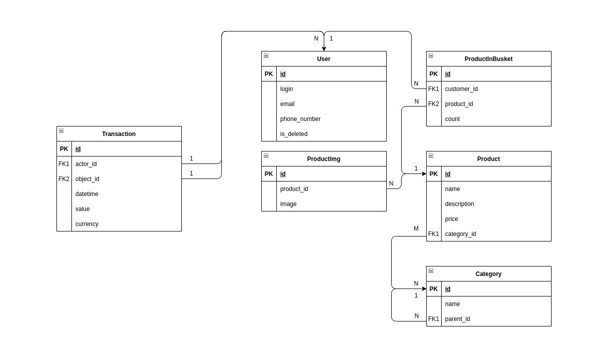

# Учебный проект
Стандартный джанго-проект для простенького магазина чего бы то ни было

Здесь освещены вопросы:
* Ложное удаление через абстрактную модель и переопределение QuerySet'a
* Переопределение и расширение стандартной модели пользователя Django
* Хранение и выдача media-файлов с Django
* Реализация категорий товаров как Closure Tree
* Поддержание консистентности дерева категорий на уровне Django Signals
* Создание моделей с валидаторами для отдельных полей (телефон, email)

### Схема базы данных

### Запуск проекта
1) Создаем окружение `python -m venv venv`
2) Активируем окружение `source venv/bin/activate` || `cd venv/Scripts` - `activate.bat` - `cd ../..`
3) Устанавливаем пакеты `python -m pip install -r requirements.txt`
4) Идем в директорию ez_shop `cd ez_shop`
5) Создаем миграции для базы данных `python manage.py makemigrations`
6) Проводим миграции `python manage.py migrate`
7) Создаем админа `python manage.py createsuperuser`
8) Запускаем сервер `python manage.py runserver`
9) По адресу `http://127.0.0.1:8000/admin/` вас ждет панель администратора проекта

Для последующих запусков необходимо только активировать окружение и запустить проект